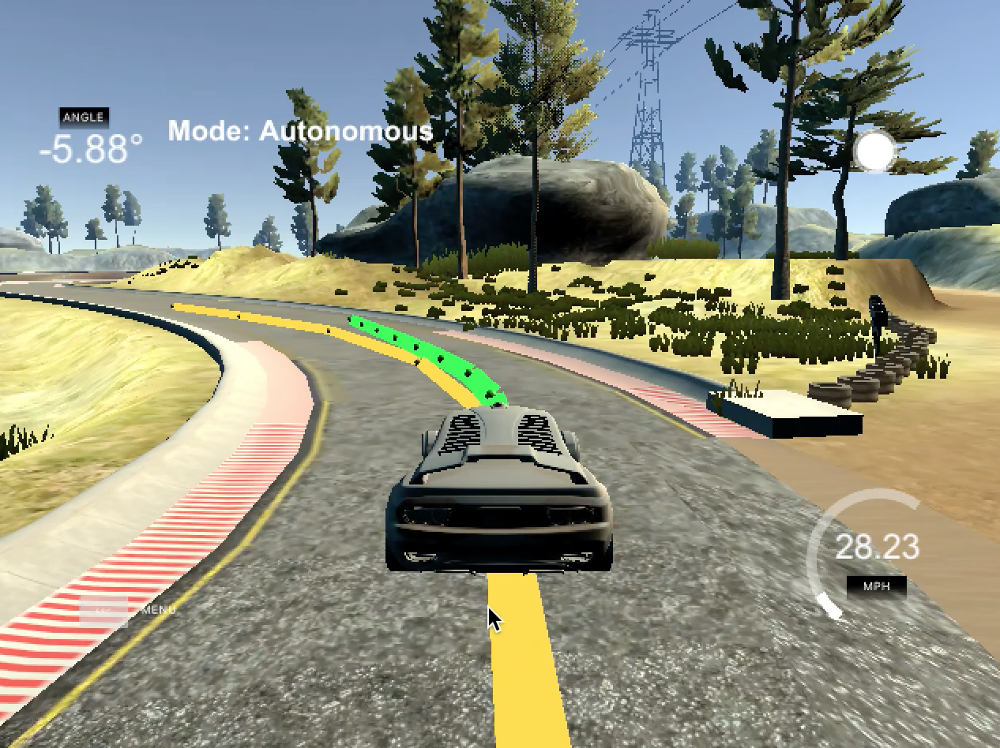

## Model Predictive Controller Project Write-Up
by **Olga Oleksyuk**


#### Overview

This is my fifth project in Term 2 of Self-Driving NanoDegree from Udacity. It involves implementing **Model Predictive Controller**.

The MPC will allow vehicle to drive autonomously on the track of `term2_sim` simulator.

From the simulator we receive information about vehicle's state as it travels through the track. The state includes `px`, `px` and `psi` to calculate `cross track error`, velocity and `psi error`.

The goal of this project is to implement MPC to consume this data and to produce `steering angle` and `throttle` to successfully navigate vehicle through the track.

### Implementation, Rubric Points

#### The Model

In this project we are set to work with Kinematic Model that consists of Vehicle State and Actuators.
Unlike Dynamic one, it ignores external forces, such as vehicle mass, tire forces, gravity, etc.

Vehicle State can be presented as a vector of `{ px, py, psi, v, cte, error_psi }`, where

    * `px` - vehicle's `x` coordinate
    * `py` - vehicle's `y` coordinate
    * `psi` - vehicle's heading direction
    * `v` - vehicle's velocity
    * `cte` - vehicle's cross-track error, distance between actual and expected trajectory
    * `error_psi` - difference in orientation of vehicle in current vs. expected reference trajectory
    
Actuators are a set of controls used to navigate the vehicle on the track. The set is a vector that consists of two elements `{ delta. a }`, where

    * `delta` - next step steering angel that should be applied, it has to be relatevly small as in real world vehicle can't take sharp turns because of it's turn radius. In the current model I tried several angels, 25 degreese, 21 degreese, 22 degreese, 21.5 degreese, 19 degreese, 15 degreese and 18.9 degreese. The last one worked the best, vehicle was making into turns without going off the road in sharp turns. I had to convert it to radiants with a help of the provided function `degTorad`.
    * `a` - acceleration/throttle that should be applied. It can be positive for acceleration forward and negative for backing up/ breaking.
    
I have used the following Kinematic equasions:

```c++
x[t + 1] = (x[t] + v[t] * cos(psi[t]) * dt);
y[t + 1] = (y[t] + v[t] * sin(psi0) * dt);
psi[t + 1] = (psi[t] + v[t] * delta[t] / Lf * dt);
v[t + 1] = (v[t] + a[t] * dt);
cte[t + 1] = ((f(x[t]) - y[t]) + (v[t] * sin(error_psi[t]) * dt));
error_psi[t + 1] = ((psi[t] - psi_des[t]) + v[t] * delta[t] / Lf * dt);  
```
where `f(x)` and `psi_des` are

```c++
f(x[t]) = coeffs[0] + coeffs[1] * x[t] + coeffs[2] * pow(x[t],2) + coeffs[3] * pow(x[t],3);
psi_des[t] = atan(coeffs[1] + 2 * coeffs[2] * x[t] + 3 *coeffs[3]* pow(x[t], 2));

coeffs = polyfit(Eigen::VectorXd::Map(ptsx.data(), ptsx.size()),
                 Eigen::VectorXd::Map(ptsy.data(), ptsy.size()), 3);
```

#### Time step Length and Elapsed Duration (`N` & `dt`)

The model can predict vehicle state every `100ms` which has been represented by `dt`. Lowering the value did not make much sense as the model will start calculating two very close state and there was not much use, just lowing down of the process of calculations.
The model currently predicts only next 10 states, it is represented via `N`. I have experimented with higher values such as 25, 20 and 15. The IPOP was not producing optimal results and the vehicle was getting of the track.
I have narrowed down `dt` to equal 0.1.

By multiplying value of `N` by `dt`: `10 * 0.1 = 1` second. The MPC will use this value to set the state only for the 1 next second. It's proved to be frequent enough to keep the vehicle's state accurate on the as high speed as 75 mph. 

#### Polynomial Fitting and MPC Pre-processing

I have implemented polynomial fitting of the 3rd orders using way points returned by a simulator. I have used this polynomial to set reference trajectory for the vehicle path. In the simulator, the reference trajectory is represented with a yellow line.

I have transformed the way points to the vehicle coordinates in the function `TransformMapCoordinates` on `MPC` class. The function takes in `px`, `py`, `psi` and `x` and `y` way points. As a results pointer values for the way points are transformed using formular:

```c++
x_transformed.push_back((x_vals[i] - px) * cos(psi) + (y_vals[i] - py) * sin(psi));
y_transformed.push_back((y_vals[i] - py) * cos(psi) - (x_vals[i] - px) * sin(psi));
```

```c++
msgJson["mpc_x"] = mpc.x_vals;
msgJson["mpc_y"] = mpc.y_vals;
```

#### Model Predictive Control with Latency

In this project I had to work with like real life latency while applying actuator inputs. To simulate the latency, inside `main()` function the thread sleeps for 100ms before applying actuator values to the simulator. To solve this problem I use two sets of actuators. The real one for the next step and the next predicted one after `dt` that equals 0.1 seconds.
By sending both actuators makes the model stay accurate and handle the latency.

### Simulator

[The link to a video of the vehicle on the track](Model Predictive Controller Project)

#### The vehicle must successfully drive a lap around the track.

The vehicle makes at least 10 successful observed laps on the track. Stays on the road without going on yellow road lines.

### Final Thoughts

After completing MPC project I have a much better understanding how vehicle can be guided to autonomous operation.
With a help of PID I have learned to predict vehicle current state based on the data from the past and with a help of MPC I have learned how to predict vehicle state in the future based on the current and past state.
